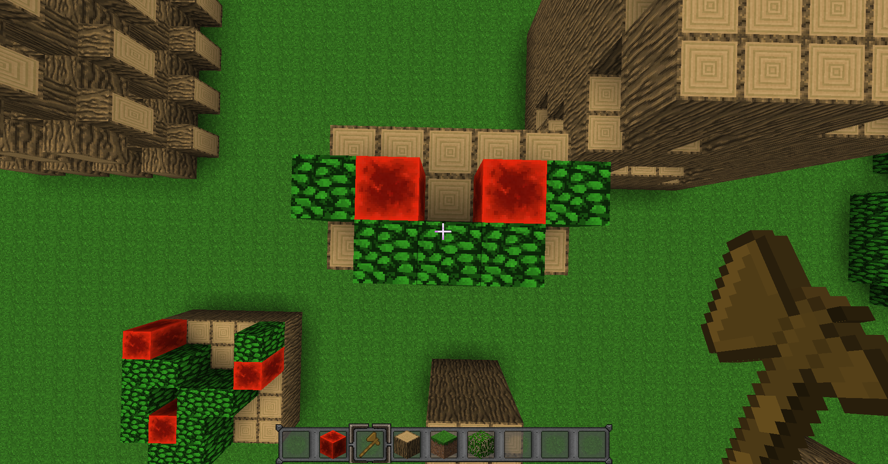
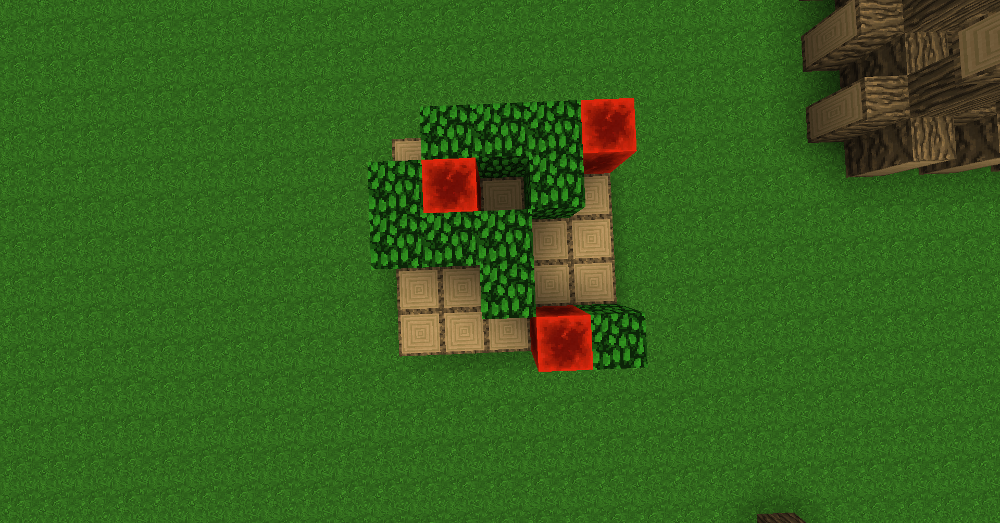

# MCWFC
<i>An implementation of the [Wave Function Collapse](https://github.com/mxgmn/WaveFunctionCollapse)
algorithm in Minecraft.</i>

## How I wanted it to work
My method may be wrong on some points, if it is, feel free to open an issue.

#### 1- The generation of the dataset (sample)
With the command `/mcwfc generate dataset <piece size>`, the user can generate a dataset with their
[WorldEdit](https://intellectualsites.github.io/download/fawe.html) selection. The selection gets
"translated" if we can say so in a `MCVirtualSpace`, and the method `generatePieces(int 
pieceSize)` is then called.

- A `Sample` is a `WeightedSet<PieceNeighbors>` (where each `PieceNeighbors` has a weight above or equal
to 1)
- A `PieceNeighbors` is a center `Piece` with its neighbors, there can be only zero or one neighbors
  (also a `Piece`) per `Face` (NORTH, SOUTH, EAST, WEST, TOP, BOTTOM, the others are not used)
- A `Piece` is what other people also call "tile" or "pattern" and is a cube of N\*N\*N blocks (in 
  Minecraft, a block is represented by a `BlockData`), where N is the `pieceSize`

- A `MCVirtualSpace` is a `VirtualSpace<BlockData>`, because `BlockData` is minecraft's block class.
- A `VirtualSpace` is an extendable 3-dimensional grid that can grow when you add new elements to it.

#### 2- (trying to) Collapse the wave
The user can make a new selection and call the command `/mcwfc generate` to create a wave within that
selection and try to collapse it. The logic for the is in the `Wave` class.

The wave is basically a `VirtualSpace<Sample>`, and at the beginning, there is a copy of the dataset
generated before at each "node" (point of the grid). Keeping `Sample`s at each node and not just
`Piece`s is useful because we need to keep track of which `PieceNeighbors` collapsed, so we can know
what that exact `PieceNeighbors` is expecting at each side (`Face`). Keeping only `Piece`s would just
let us know what all `PieceNeighbors` in the dataset with that piece as the centerpiece are expecting
at each side.

## I need Help !
With [this commit](https://github.com/bananasmoothii/MCWFC/commit/c91d152d3099eec47a59c0855d0e84c59417e41f),
I couldn't get anything else than empty waves, where each `PieceNeighbors` is impossible.

I am using this to generate my dataset, it is 5\*1\*3 (the oak logs below are not included), and I set the
piece size (N) to 1 so each piece only contains one block:

I am using "modulo coords", that means that when the generator is reaching a side, it just goes to the
opposite side. That means that the two oak leaves blocs at the sides are actually connected.

The dataset generation seems to work properly, as I added a `/mcwfc dumppiece <piece number>` command
to see a piece along with its neighbors, and I found everything I wanted: a redstone block is always
connected to a leaves block in a corner, and a leaves block is always connected to another leaves block
in straight line.

However... I got this (with [the commit right before the one where I said I am abandonning](https://github.com/bananasmoothii/MCWFC/tree/c91d152d3099eec47a59c0855d0e84c59417e41f)):

And also I got a lot of impossible states.

**Any help or advice would be greatly appreciated !**

***
PS: I'm French, so if you see some badly named or explained things, feel free to tell me !
